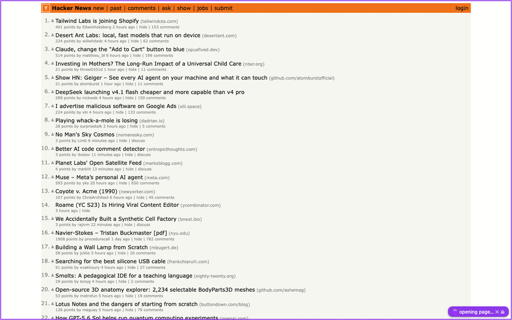
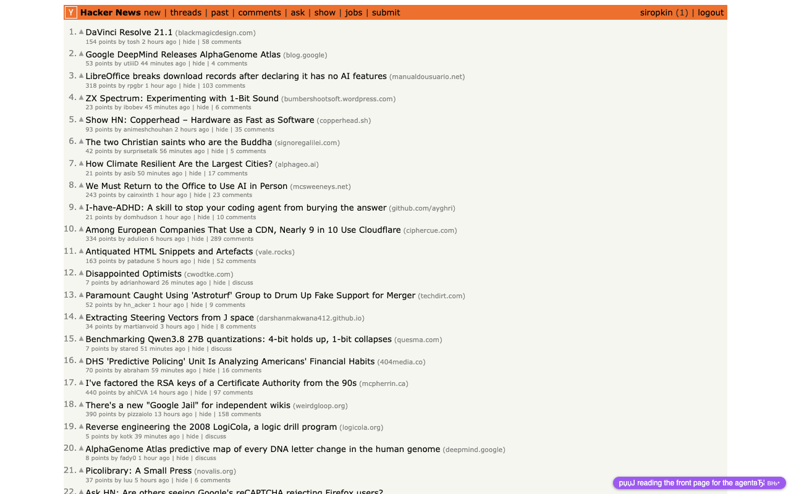

<p align="center"></p>

# chrome-bridge

**English** | [中文](README.zh-CN.md)

[](LICENSE) [](https://nodejs.org) [](package.json)

Let **any AI agent** drive the Chrome you're already using — your open tabs, logged-in sessions, SSO. Playwright and friends drive a browser they launched, with a profile of their own; MCP bridges need an MCP-capable client and a configured server. chrome-bridge needs neither: it drives the Chrome you're logged into — that's the only mode — with one small extension and one zero-dependency Node CLI. Every tab the agent touches wears a 🟣 pill that narrates what it's doing.



A tiny Chrome extension (from the [Chrome Web Store](https://chromewebstore.google.com/detail/chrome-bridge/kmhjlnokjigmnimgjjmiahlinjbcebkg), or load the unpacked folder) connects over WebSocket to a local Node server; anything that can run a shell command can drive the browser:

```bash
node server.mjs &                        # start the bridge (Node ≥ 18, no deps)
node cli.mjs snap localhost:8082         # compact a11y snapshot with element refs
node cli.mjs click localhost:8082 @e4    # click by ref
node cli.mjs fill localhost:8082 @e2 "hello@example.com"
node cli.mjs shot localhost:8082 out.png --max 800 --format jpeg
```

A `snap` looks like this — the whole page as a compact text tree with refs you act on:

```
table "Hacker News new | past | comments | ask | show | jobs | submit" @e1
  link "Hacker News" @e5
  link "new" @e6
  link "submit" @e12
  link "login" @e13
table "1. Playa Phone (playaphone.com) 122 points by cutoff 1 hour…" @e14
  link "Playa Phone" @e16
  link "41 comments" @e21
```

Link URLs are omitted by default (in our traces they dominated snapshot tokens — the `@eN` ref is what you click); nameless links keep theirs, and `snap --href` brings them all back.

A real run, verified live against GitHub: [recipes/github.com.md](recipes/github.com.md) — set a repo's social preview image via the CLI, gotchas included (og:image verification, the is-default false-failure, the net/upload debugger conflict).

## Quick start

Requires macOS/Linux (or Git Bash on Windows), Chrome ≥ 117 (ask / `snap --find` / `console --ask` additionally need ≥ 138 for the built-in Nano model), and Node ≥ 18.

**One paste, one click.** Paste this into your AI agent (Claude Code, Cursor, Qwen, GLM, …) — it clones the repo, starts the bridge, installs its own integration (the Claude Code skill, or a one-liner in its instructions file), and asks you for the one Chrome click scripts can't do:

````text
Set up chrome-bridge — the bridge that lets you drive my real, logged-in Chrome — and install your end of it. Do every step yourself and tell me the result of each. The only thing I do is the one-time extension load in Chrome (step 3).

1. Pick the repo root `<repo>`:
   - if your working directory is already a chrome-bridge checkout (it contains `cli.mjs` and `AGENTS.md`), use it;
   - else if `~/chrome-bridge/cli.mjs` exists, run `git -C ~/chrome-bridge pull --ff-only` (if the pull fails, show me the error and keep the existing copy) and use `~/chrome-bridge`;
   - else clone it and use `~/chrome-bridge`:

     ```
     git clone https://github.com/siropkin/chrome-bridge.git ~/chrome-bridge
     ```

     (if the clone fails — e.g. `~/chrome-bridge` exists with other content — show me the error and stop; don't delete or move anything)

   Substitute `<repo>` with the real path everywhere below.

2. Bring the bridge up on this checkout's code (needs Node ≥ 18 — if Node is missing or older, tell me and stop; don't install or upgrade anything yourself):

   ```
   node <repo>/cli.mjs stop
   node <repo>/cli.mjs start
   node <repo>/cli.mjs health
   ```

   (`stop` reporting "nothing was running" is fine; the stop-then-start pair guarantees the server runs the code you just fetched, not some older copy from another location — a loaded extension reconnects on its own.)

   - health prints a ⚠ line saying the loaded extension's version differs from the repo → ask me to reload the extension at `chrome://extensions`, then re-run health.
   - health reports `"extension":true` (with no ⚠) → jump to step 4.
   - health reports `"extension":false` → step 3. But if the extension was connected before your restart, wait ~10s and re-run health once first — it reconnects on its own after a server restart.
   - server won't start → show me the error and the last lines of `<repo>/server.log` (if it exists), then stop.

3. The one click only I can do — unless I installed Chrome Bridge from the [Chrome Web Store](https://chromewebstore.google.com/detail/chrome-bridge/kmhjlnokjigmnimgjjmiahlinjbcebkg), in which case skip this step entirely: the store copy connects on its own, and loading the unpacked folder too creates a second profile seat that makes every command demand `--profile`. Otherwise: ask me to open `chrome://extensions`, enable Developer mode, click Load unpacked, and select the `<repo>/extension` folder. On macOS you may run `open -a "Google Chrome" "chrome://extensions"` first. Then poll `node <repo>/cli.mjs health` every 5s (up to ~90s) until it reports `"extension":true`; if it doesn't, tell me what's still missing and stop — don't keep polling.

4. Install your integration — pick the ONE that applies to you:
   - Claude Code — copy the skill so it auto-loads on browser tasks in every project (use `./.claude/skills/` instead of `~/.claude/skills/` only if I told you to scope it to this project):

     ```
     rm -rf ~/.claude/skills/chrome-bridge && mkdir -p ~/.claude/skills && cp -r <repo>/.claude/skills/chrome-bridge ~/.claude/skills/
     ```

   - any other agent (Cursor, Qwen, GLM, Kimi, …) — append this line to the instructions file you read at session start (`CLAUDE.md`, `AGENTS.md`, `.cursorrules`, …; create it in the project you're working in if none exists), but only if it's not already there. If your instructions live somewhere you can't edit, print the line and tell me to paste it there:

     ```
     To drive my Chrome browser (real logged-in tabs), read <repo>/AGENTS.md and run `node <repo>/cli.mjs <command>`. If the health check fails, run `node <repo>/cli.mjs start`; it waits briefly for an already-loaded extension to reconnect. If health still reports the extension disconnected afterward, tell me to reload it.
     ```

5. Tell me the bridge is up. From the next session your integration auto-loads; in this one, read `<repo>/AGENTS.md` when a browser task comes up.
````

That one click, when the agent asks: `chrome://extensions` → Developer mode → **Load unpacked** → select the `extension/` folder (Chrome requires that click — scripts can't). Verify either way: `node cli.mjs health` → `{"ok":true,"extension":true}`.

Agents with web access can skip the copy-paste entirely: tell yours `read https://raw.githubusercontent.com/siropkin/chrome-bridge/master/docs/agent-setup.md and do what it says`.

Prefer to do it yourself? The manual path:

```bash
git clone https://github.com/siropkin/chrome-bridge && cd chrome-bridge && ./install.sh
```

`install.sh` starts the server and opens `chrome://extensions` (macOS; on Linux open it yourself); then load the extension as above. Details in [Install detail](#install-detail). Installed Chrome Bridge from the [Chrome Web Store](https://chromewebstore.google.com/detail/chrome-bridge/kmhjlnokjigmnimgjjmiahlinjbcebkg)? Skip the Load unpacked step — the store copy already connects; loading the unpacked folder too creates a second profile seat and every command will demand `--profile`.

That's the whole integration. `AGENTS.md` is a self-contained operating manual — commands, recipes, gotchas — that any agent with file or web access can read. Agents with web access can read it straight from GitHub: `https://raw.githubusercontent.com/siropkin/chrome-bridge/master/AGENTS.md`.

## The human stays in control

Tabs the bridge drives get a 🟣 pill in the bottom-right corner (click it for the full action history; ✕ hides it until the next navigation; ⏏ disconnects the agent from the tab) and join a 🟣 tab group so you always know what's being automated — including read-only commands (`snap`, `measure`, `console`): any tab the agent is *looking at* wears the pill, not just the ones it changes. The pill narrates what the agent is doing right now (`🟣 taking screenshot…`, `🟣 reading page…`, with elapsed seconds while a command runs) and its history panel lists the last actions, scrolled to the newest; when nothing's running it reads `🟣 AI idle` — plus `⚠ N failed since last ok` until a command lands again, and `⚠ bridge offline` while the server is unreachable. While a command runs, a purple viewport frame lights up, the tab's favicon shows ⏳ (✅ when it lands, ✗ when it fails — the ✗ stays until the next command), and clicks/hovers flash a purple pointer where the agent acts. `release` (or `close`) gives them back. The ⏏ is the human's escape hatch: one trusted click ends the bridge's claim on the tab — markers, group, device emulation, all of it — no CLI needed (synthetic page clicks can't fake it).



## Why not Playwright (or playwright-mcp)?

Playwright drives a browser it launched — a separate Playwright-managed profile, not the Chrome you're logged into, so the agent starts every session logged out (attach modes exist — a `--remote-debugging-port` relaunch, or playwright-mcp's extension mode — but they're opt-in, and playwright-mcp now also ships a CLI for coding agents). chrome-bridge drives the Chrome you're already looking at; that's the only mode. It borrows Playwright's two best ideas (accessibility-tree snapshots with element refs, ref-based actions) and skips the 40 MB dependency and the separate profile.

## Why not an MCP browser bridge?

MCP bridges (mcp-chrome, BrowserMCP) need an MCP-capable client and a configured, long-running MCP server (playwriter ships a CLI too, but still launches/attaches a browser instance). Chrome DevTools MCP's no-MCP CLI can attach to your real profile (`--autoConnect`, Chrome 144+) — as an opt-in flag, and its pitch is DevTools depth (performance traces, debugging), not minimalism. chrome-bridge's real-browser mode is the *only* mode, and the client is anything that can run a shell command: a plain CLI plus one command endpoint (`POST /cmd`) — nothing for the agent to install or configure — and the same commands work from a script, a cron job, or your own terminal.

## Install detail

`install.sh` checks Node ≥ 18, starts the server in the background (logs to `server.log`), opens `chrome://extensions` (macOS; on Linux open it yourself), waits for the extension to connect (up to ~90s), and prints the agent one-liner with your real path filled in. If the server dies or the machine reboots, the agent's health check fails and it can restart it itself with `node cli.mjs start` (`node cli.mjs stop` shuts it down).

After loading the extension you won't see anything until the bridge server is running and your AI tool sends its first command — from then on, any tab the agent touches wears the purple 🟣 pill. Silence before that is normal, not a broken install.

**Upgrades**: after `git pull`, restart the server — it runs the code from when it was started, and its health check still passes, so nothing else reminds you. Also reload the extension at `chrome://extensions` (the service worker is old code too — `node cli.mjs health` prints a warning when the loaded extension's version differs from the repo):

```bash
node cli.mjs stop && node cli.mjs start
```

**Port**: the bridge lives on 127.0.0.1:9333 everywhere. `BRIDGE_PORT` moves the server and CLI (the installer insists on 9333) — but the extension always dials 9333; if you must change the port, edit `extension/background.js` too. Server won't start and `server.log` shows `EADDRINUSE` → something else holds 9333: find it with `lsof -i :9333` (often an old server from another checkout — `node <that-repo>/cli.mjs stop` frees it).

**Windows**: `install.sh` is bash (macOS/Linux, or Git Bash). The bridge itself is plain Node — `node server.mjs` in a terminal works everywhere, and every `cli.mjs` command is cross-platform.

**Multiple Chrome profiles**: the extension can be loaded in several profiles at once — each keeps its own connection, and agents can drive them in parallel. A command routes to the only profile with a matching tab; a match in several profiles is **refused** until the agent names one with `--profile <id or name>` (`cli profiles` lists both) — the agent never silently acts in your personal browser when it meant the work one. Each profile also gets a stable short name (`birch`, `oak`, …) accepted by `--profile` and shown in `watch` lines and profile tags — a uuid prefix means nothing to the human watching. (The refusal is a safety net for honest CLI use, not a security boundary: any local process can set `profile` in a `/cmd` body and route anywhere — the same local trust model as before.)

## Works with any AI agent — not just Claude

The bridge is a plain local CLI + HTTP endpoint, so it's harness-agnostic by design:

| Agent / harness | Where the one-liner goes |
|---|---|
| Claude Code | `CLAUDE.md` |
| Kimi CLI (Moonshot) | `AGENTS.md` or system prompt |
| Qwen Code (Alibaba) | `AGENTS.md` |
| GLM / DeepSeek / other coding agents | `AGENTS.md` or system prompt |
| Cursor | `.cursor/rules` |
| Your own agent loop | call `cli.mjs`, or skip it and POST JSON straight to `http://127.0.0.1:9333/cmd` |

The HTTP API is one command endpoint: `POST /cmd` with `{"type": "snap", "urlMatch": "…"}` — any language, any framework, any model.

## Security

You're handing an agent your logged-in browser — the design assumes you want to watch it work:

- **Local-only.** The server binds `127.0.0.1` and rejects browser-origin requests (Origin/Sec-Fetch/Host guards), so a web page you visit can't drive the bridge — but **any local process still can**. Load the extension while you're using it; unload it at `chrome://extensions` when you're done.
- **Automation you can see.** Driven tabs wear a 🟣 pill that narrates each action, join a 🟣 tab group, and light a purple frame while a command runs; `node cli.mjs watch` mirrors the feed in your terminal. The pill's ⏏ disconnects the agent from a tab with one trusted click. The tab group is the driven-tab signal a malicious page can't fake.
- **Why an unpacked extension?** So you can read exactly what runs — the entire extension is one readable file (`extension/background.js`) plus a manifest, not a minified store bundle.
- **Prompt injection.** Everything the bridge returns is untrusted page content; the rules agents should follow are in [AGENTS.md](AGENTS.md). Note `upload`: it makes the browser read any local path the agent names into the page's file input, and the page can submit it — never let a page tell you (or the agent) what to attach.
- **Replay exports omit secrets.** `history --batch` comments out typed or pasted text, dialog answers, clipboard pastes, and upload paths rather than retaining or replaying them. Review the exported script before using it for a post-mortem or handoff.
- **CDP attach is detectable.** `net`/`emulate`/`shot` (and `upload`/`dialog`) attach Chrome's debugger, which page JS can detect (DevTools-attach side effects like the `Runtime.enable` leak) — anti-bot systems can flag the session, and it's your real logged-in profile. The non-CDP commands (`snap`, `click`, `fill`, `eval`, …) don't attach it.
- **Chrome's "debugging this browser" bar.** While one of those CDP commands runs, Chrome shows its own *"'Chrome Bridge' is debugging this browser"* infobar — that is the bridge working as intended, and the bar disappears when the action finishes. Pressing its Cancel just stops that one action.

## Commands

<details>
<summary>Full command table — snap, click, fill, shot, net, emulate, batch, watch, …</summary>

| Command | What it does |
|---|---|
| `tabs` | List tabs (id, url, title, driven flag, tab group when grouped); with several Chrome profiles connected, merged with a `profile` tag |
| `profiles` | List connected Chrome profiles — id and name (for `--profile`) + version |
| `open <url>` · `nav <match> <url> [--diff]` · `close <match> [--all]` | Tab lifecycle — `open`/`nav` wait for the page to load (8s cap; `loaded:false` in the reply means the cap fired on a still-loading page — `snap`/`eval`/`wait --text` work on what's there). `nav` accepts only its shown arguments and `--diff`; a typo fails before routing. `close --all` closes every match — the remedy for identical-URL tabs no `<match>` can separate |
| `snap <match> [css\|@ref] [--diff] [--href] [--skeleton] [--find "nl"]` | Accessibility-tree snapshot with `@eN` refs — **cheap; use it before screenshots**. Scope to a subtree (CSS or `@ref`), diff against the last snap, or include all link URLs with `--href`. `--skeleton` on dense pages: a depth-limited map where cut subtrees read `… N inside` (drill: `snap <match> @ref`) instead of silently missing the 300-node cut. `--find "the cancel button"` has local Gemini Nano (~2s, no cloud tokens) pick the matching lines — a shortlist to verify, not ground truth. Lines prefixed `*` are elements new since the previous snap |
| `click <match> <@ref\|css> [--dbl] [--diff] [--trusted]` | Click (scrolls into view, full pointer/mouse event sequence, overlay-coverage check); `--dbl` double-clicks; `--trusted` drives CDP Input — isTrusted=true, so canvas tools (Figma) accept it |
| `drag <match> <@ref\|css> <@ref\|css> [--diff] [--trusted]` | Drag one element onto another (synthetic pointer sequence; `--trusted` = CDP Input — isTrusted, and legacy HTML5 dragstart/drop fire) |
| `dialog <match> accept\|dismiss [--text s]` | Answer a JS dialog over CDP — reachable only if it opened during a live debugger session (`net`/`shot`/…); a dialog that wedged an unattached tab can't be answered: recover with `nav <match> <url>` (navigation drops it). `--text` requires an answer |
| `fill <match> <@ref\|css> <value> [--diff]` | Set input value — React-safe (native setter + input/change events); on a native `<select>` matches option value or label |
| `type <match> <@ref\|css> <text> [--diff] [--trusted]` · `press <match> <key> [@ref] [--diff] [--trusted]` · `hover <match> <@ref\|css> [--diff] [--trusted]` | Per-char typing (autocomplete UIs), key presses (`Control+k` combos work), hover; `--trusted` drives CDP Input (isTrusted=true — canvas tools accept it; Enter triggers browser defaults like form submit) |
| `paste <match> [@ref\|css] [--diff] [-- <text>]` | Real-paste semantics into the focused (or given) field — rich editors that revert `fill` (Quill, Reddit/LinkedIn composers) take a paste; without `-- <text>` it reads the OS clipboard |
| `scroll <match> <up\|down\|top\|bottom\|@ref\|css> [--diff]` | Scroll — finds the real scroller on app-shell pages (Linear, Gmail) that scroll an inner panel, not the window |
| `upload <match> <@ref\|css> <file...> [--diff]` | Set a file input's files via CDP — works on hidden inputs; target the input or an element wrapping it. `--diff` is the only option; an unknown `--flag` fails instead of being treated as a file |
| `ask <match> <question>` | *(experimental)* Local Gemini Nano answers from page text — no cloud tokens, pre-filter quality |
| `wait <match> [css\|--text t\|--human\|--pixel-change] [--timeout ms]` | Wait for element or visible text — MutationObserver-driven, resolves as soon as the page changes (timeout default 10s, max 60s). `--human` hands the tab to you — CAPTCHA/2FA/login walls: the pill says it's your turn, the command blocks until you act (default 2 min), then returns the snap-diff of what you did. `--pixel-change` polls until pixels move (canvas changes the tree can't see) |
| `eval <match> <js\|-> [--world main|isolated]` | Run JS in the page; `-` reads from stdin |
| `shot <match> <out> [--max px] [--scale N] [--format jpeg] [--quality N] [--crop x,y,w,h] [--full] [--diff]` | Screenshot via CDP. Long edge capped at `--max` px (default 1280, `0` = native res) — models downscale big images on read anyway, so native res buys file size, not detail. `--full` = whole page height. `--diff` compares against the previous `--diff` shot (pinned to the baseline's size/scale, current scroll position — it watches what the agent sees) and saves only the changed region — canvas/pixel changes the a11y tree can't see |
| `net <match> [--dur ms] [--filter s] [--body s] [--ws] [--har out.har]` | Capture network traffic via CDP (≤30s per run) — one compact line per request, each naming its initiator (`⟵ api-client.js:88`); `--ws` also captures WebSocket frames (`→` sent / `←` received — chat/streaming apps); `--body s` appends matching JSON/text response bodies; `--har out.har` saves the capture as a shareable HAR 1.2 (opens in DevTools/Burp) |
| `fetch <match> <url> [--out file]` | In-page fetch riding the logged-in session — login-walled JSON/feeds answer it without `eval` plumbing; binary responses need `--out`, text prints capped at 50K chars (`--out` gets the full body) |
| `measure <match> <css>` | Bounding rect + computed styles as JSON — layout truth without pixels |
| `console <match> [--clear] [--ask [q]]` | Page console + uncaught errors (hook installs on first call); `--ask` triages the log with local Gemini Nano — only the verdict costs cloud tokens |
| `grid <match>` | Toggle an 8px alignment grid overlay |
| `emulate <match> <w> <h> [mobile]` · `emulate <match> focus` · `unemulate <match>` | Switch between desktop and mobile device views — CDP emulation, no window resize; `focus` makes the page believe it's focused — focus-gated background-tab work keeps running (does not render an occluded window). `mobile` and `focus` are the only modes |
| `resize <match> <w> <h>` | Resize the window |
| `batch` | Run commands from stdin, one per line — one process for a whole sequence; stops on the first error |
| `mark <match>` · `release <match>` | Add/remove the driven-tab corner tag + 🟣 tab group; `release` also clears device emulation — the tab is fully the human's again |
| `note <match> <text>` | Narrate to the human — the text appears in the driven tab's pill and its history (the pill already shows *what* runs; notes add *why*) |
| `watch` | Live feed of every bridge command in your terminal — the twin of the in-page pill. Run it next to your agent session and follow along; Ctrl-C to exit |
| `history [match] [-n N] [--batch out]` | What the bridge already ran on this machine (server ring, last 300 commands) — filter by match, take the newest N; `--batch out` exports it as a replayable batch script (failed commands commented out; typed/pasted text, dialog answers, clipboard pastes, and upload paths redacted, never exported). Post-mortems and session handoffs |
| `swlogs` | Service-worker console tail (errors/warnings) |
| `start` · `stop` | Server lifecycle — `start` spawns it detached if down (agents can self-heal a dead server) |

`<match>` is a substring of the tab URL or title and must identify exactly one tab in the selected profile. If several match, the command is refused before it marks or acts on anything — re-run with a longer match. Refs survive re-`snap`s (an element keeps its `@eN` while its role+name are unchanged) and expire on navigation — re-`snap` after `nav`. `snap` walks open shadow roots (their elements get refs and click/fill straight in), and CSS selectors pierce open roots too.

If a command times out **after dispatch**, it may have acted before its reply was lost: inspect the tab or `history` before retrying a non-idempotent operation. A timeout **before dispatch** explicitly did not run.

</details>

## Desktop & mobile device emulation

Switch any tab between desktop and mobile device views without resizing your window — same mechanism as the DevTools device toolbar (CDP metrics + touch + mobile UA):

```bash
node cli.mjs emulate news.ycombinator.com 390 844 mobile   # iPhone-sized view, touch + mobile UA
node cli.mjs emulate news.ycombinator.com 1440 900         # desktop-sized view
node cli.mjs unemulate news.ycombinator.com                # back to normal
```


## Token-efficient agent workflow

1. **`snap` first** — a text tree costs roughly an order of magnitude fewer tokens than a screenshot and usually answers the question.
2. Keep it small: `snap <match> "dialog"` scopes to a subtree; after an action, `snap --diff` returns only what changed (refs stay stable across snaps).
3. **Act + observe in one call**: `click <match> @e4 --diff` runs the click, settles (waits for the DOM to go quiet, 3s cap), and returns the diff of exactly the action's effects in the same result, prefixed with a **verdict** — `succeeded` / `needs_human` (bot walls are named) / `blocked` (rate limit) / `uncertain` (nothing observable changed — never read it as ok). No separate `wait` and `snap` round trips.
4. `shot` only when pixels matter, and then cheap: `--max 800 --format jpeg`, or `--crop` to the component.
5. For layout questions ("is this centered?") trust `measure` numbers, not eyeballs.
6. Batch independent steps — `printf 'click m @e4\nfill m @e2 "hi"\n' \| node cli.mjs batch` — one process and one shell call for the whole sequence.

## Design reviews

[design-eye.md](design-eye.md) — a procedure for comparing an implementation against a Figma/mockup without missing alignment and containment details. Includes the 8px alignment grid overlay:


## Development

`node test/selftest.mjs` — end-to-end check with a fake extension (no Chrome needed); runs on every push via GitHub Actions (Node 18/20/22). How to land changes (selftest gate, version bump, tags, style): see *Developing* in [AGENTS.md](AGENTS.md).

chrome-bridge is **not on npm** — the only install path is this repo (anything `npm install chrome-bridge` gives you is an unrelated package). To pin what an agent will run, check out a tag — e.g. `git checkout v1.18.13`; `git tag -l` lists the latest.

## License

MIT
