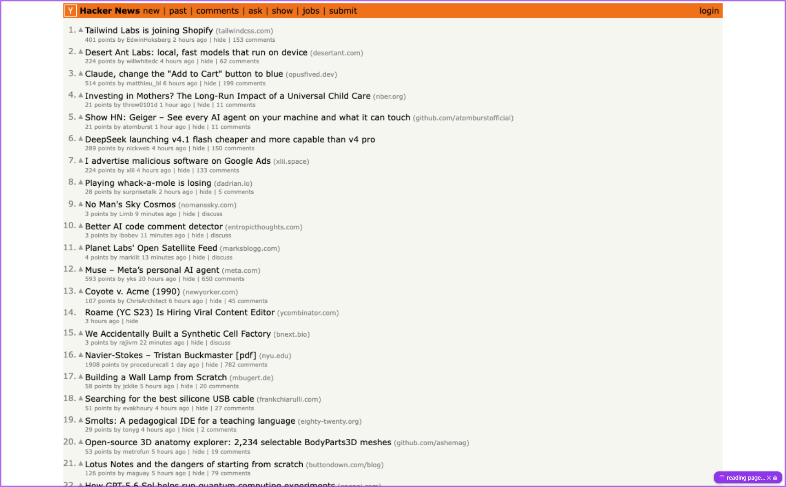
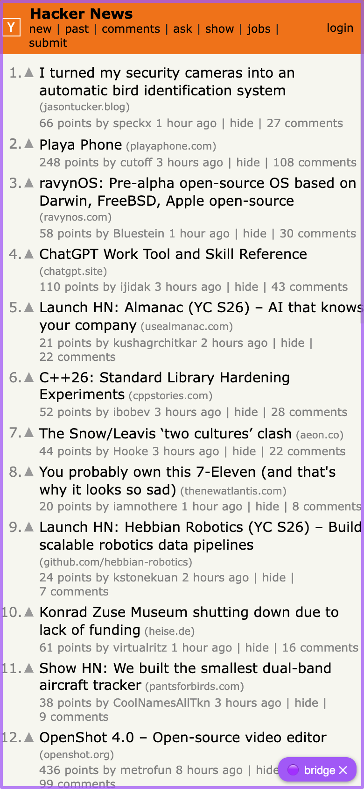
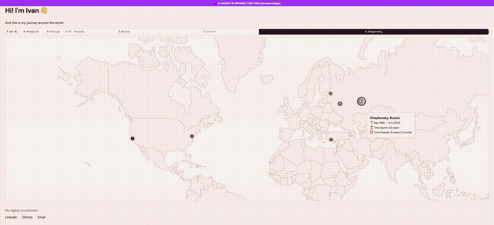

# chrome-bridge

[English](README.md) | **中文**

[](LICENSE) [](https://nodejs.org) [](package.json)

让**任何 AI 智能体**驱动你**真实的** Chrome 浏览器——你已经打开的标签页、已登录的会话、SSO 和 Cookie。无需新的浏览器配置文件,无需 `--remote-debugging-port` 重启,无需 MCP 服务器,零 npm 依赖。



一个小小的 Chrome 解压扩展通过 WebSocket 连接到本地 Node 服务器;任何能执行 shell 命令的工具都能驱动浏览器:

```bash
node server.mjs &                        # 启动桥接服务(Node ≥ 18,零依赖)
node cli.mjs snap localhost:8082         # 紧凑的无障碍树快照,带元素引用
node cli.mjs click localhost:8082 @e4    # 按引用点击
node cli.mjs fill localhost:8082 @e2 "hello@example.com"
node cli.mjs shot localhost:8082 out.png --scale 0.5 --format jpeg
```

`snap` 的输出长这样——整个页面变成一棵紧凑的文本树,你可以直接操作其中的引用:

```
table "Hacker News new | past | comments | ask | show | jobs | submit" @e1
  link "Hacker News" @e5 https://news.ycombinator.com/news
  link "new" @e6 https://news.ycombinator.com/newest
  link "submit" @e12 https://news.ycombinator.com/submit
  link "login" @e13 https://news.ycombinator.com/login?goto=news
table "1. Playa Phone (playaphone.com) 122 points by cutoff 1 hour…" @e14
  link "Playa Phone" @e16 https://playaphone.com/
  link "41 comments" @e21 https://news.ycombinator.com/item?id=49510514
```

## 为什么不用 Playwright(或 playwright-mcp)?

Playwright 驱动的是它自己启动的浏览器——或者需要用调试端口重启的浏览器——所以你会丢失当前的登录会话。chrome-bridge 驱动的是你正在使用的 Chrome。它借鉴了 Playwright 最好的两个设计(带元素引用的无障碍树快照、基于引用的操作),同时省掉了 40 MB 的依赖和全新的浏览器配置。

## 为什么不选 MCP 浏览器桥?

MCP 桥接工具(mcp-chrome、BrowserMCP、playwriter)同样可以驱动你真实的浏览器——但它们要求客户端支持 MCP,还需要配置一个长期运行的 MCP 服务器。(上文提到的 playwright-mcp 也是一种 MCP 桥——只是它还会丢失你的登录会话。)chrome-bridge 只是一个普通的 CLI 和一个 HTTP 端点(`POST /cmd`):任何能执行 shell 命令的智能体都能直接使用——智能体侧无需安装、无需配置——同样的命令也可以用在脚本、cron 任务或你自己的终端里。

## 安装

两部分:一个**解压加载的 Chrome 扩展**(MV3)和一个**本地 Node 服务器**。不需要 npm install。

```bash
git clone https://github.com/siropkin/chrome-bridge && cd chrome-bridge && ./install.sh
```

`install.sh` 会检查 Node ≥ 18、启动服务器、打开 `chrome://extensions`,并打印下方的智能体接入语句。唯一的手动步骤:点击 **加载已解压的扩展程序(Load unpacked)** → 选择 `extension/` 文件夹(Chrome 要求必须手动点击)。

验证:`node cli.mjs health` → `{"ok":true,"extension":true}`

被桥接驱动的标签页会显示紫色横幅并加入 🟣 标签页分组,你随时知道哪些页面正在被自动化;`release`(或 `close`)即可归还。

## 接入 AI 智能体——只需一行

把下面这行粘贴到你的智能体指令中(`CLAUDE.md`、`.cursorrules`、`AGENTS.md`、系统提示词……)——`install.sh` 会打印出填好真实路径的版本:

> 驱动我的 Chrome 浏览器(真实的已登录标签页)时,阅读 `<path>/chrome-bridge/AGENTS.md` 并运行 `node <path>/chrome-bridge/cli.mjs <command>`。如果 health 检查失败,告诉我启动桥接服务。

这就是全部集成工作。[AGENTS.md](AGENTS.md) 是一份自包含的操作手册——命令、配方(React 安全的表单填写、API Mock、网络计时)和注意事项——为任何能执行 shell 命令的智能体而写。有联网能力的智能体可以直接从 GitHub 阅读:`https://raw.githubusercontent.com/siropkin/chrome-bridge/master/AGENTS.md`。

## 支持任何 AI 智能体——不限于 Claude

桥接器就是一个普通的本地 CLI + HTTP 接口,设计上与具体 harness 无关:

| 智能体 / harness | 一行指令放在哪里 |
|---|---|
| Claude Code | `CLAUDE.md` |
| Kimi CLI(月之暗面) | `AGENTS.md` 或系统提示词 |
| Qwen Code(阿里通义) | `AGENTS.md` |
| GLM / DeepSeek / 其他编程智能体 | `AGENTS.md` 或系统提示词 |
| Cursor | `.cursor/rules` |
| 你自己的智能体循环 | 直接调用 `cli.mjs`,或向 `http://127.0.0.1:9333/cmd` POST JSON |

HTTP API 只有一个端点:`POST /cmd`,Body 如 `{"type": "snap", "urlMatch": "…"}`——任何语言、任何框架、任何模型都能用。

## 命令

| 命令 | 作用 |
|---|---|
| `tabs` | 列出标签页(id、url、标题、是否被驱动) |
| `open <url>` · `nav <match> <url>` · `close <match>` | 标签页生命周期 |
| `snap <match> [css] [--diff]` | 无障碍树快照,带 `@eN` 引用——**便宜,优先于截图使用**。可限定子树,或与上一次快照对比 |
| `click <match> <@ref\|css>` | 点击(自动滚动到可见位置,完整 pointer/mouse 事件序列,遮挡检测) |
| `fill <match> <@ref\|css> <value>` | 设置输入框的值——React 安全(原生 setter + input/change 事件) |
| `type <match> <@ref\|css> <text>` · `press <match> <key>` · `hover <match> <@ref\|css>` | 逐字符输入(自动补全 UI)、按键、悬停 |
| `wait <match> [css\|--text t] [--timeout ms]` | 等待元素或可见文本出现 |
| `eval <match> <js\|-> [--world main]` | 在页面中执行 JS;`-` 从 stdin 读取 |
| `shot <match> <out> [--scale N] [--format jpeg] [--quality N] [--crop x,y,w,h] [--full]` | CDP 截图(`--full` = 整页高度) |
| `net <match> [--dur ms] [--filter s]` | CDP 网络抓包——每个请求一行紧凑输出 |
| `measure <match> <css>` | 元素位置 + 计算样式,JSON 输出——不看像素也能知道布局真相 |
| `console <match> [--clear]` | 页面 console + 未捕获错误(首次调用时安装钩子) |
| `grid <match>` | 开关 8px 对齐网格覆盖层 |
| `emulate <match> <w> <h> [mobile]` · `unemulate <match>` | 桌面 / 移动设备视图切换——CDP 模拟,无需调整窗口大小 |
| `resize <match> <w> <h>` | 调整窗口大小 |
| `mark <match>` · `release <match>` | 添加 / 移除紫色驱动标记横幅 + 标签页分组 |

`<match>` 是标签页 URL 的子串;匹配多个时取最近活动的那个。引用在重复 `snap` 之间保持稳定(只要 role+name 不变,元素就保持它的 `@eN`),但导航后失效——`nav` 之后请重新 `snap`。

## 桌面与移动设备模拟

无需调整窗口大小,即可把任何标签页在桌面和移动设备视图之间切换——与 DevTools 设备工具栏相同的机制(CDP 指标 + 触摸 + 移动端 UA):

```bash
node cli.mjs emulate news.ycombinator.com 390 844 mobile   # iPhone 尺寸视图,触摸 + 移动端 UA
node cli.mjs emulate news.ycombinator.com 1440 900         # 桌面尺寸视图
node cli.mjs unemulate news.ycombinator.com                # 恢复正常
```



## 省 token 的智能体工作流

1. **先 `snap`**——文本树的 token 开销约为截图的 1/10,而且通常已经能回答问题。
2. 保持小巧:`snap <match> "dialog"` 限定子树;操作之后用 `snap --diff` 只返回变化的部分(引用跨快照保持稳定)。
3. 按引用操作:`click @e4`、`fill @e2 "…"`、自动补全 UI 用 `type @e2 "query"`。
4. 只有需要像素时才 `shot`,且尽量便宜:`--scale 0.5 --format jpeg`,或 `--crop` 到组件区域。
5. 布局问题("这个居中了吗?")相信 `measure` 的数字,而不是肉眼。

## 设计走查

[design-eye.md](design-eye.md)——一套对比实现与 Figma/设计稿的流程,不会漏掉对齐和包含关系等细节。包含 8px 对齐网格覆盖层:



## 开发

`node test/selftest.mjs`——用模拟扩展做端到端检查(不需要 Chrome)。

## 安全

服务器只绑定 `127.0.0.1`,并拒绝来自浏览器页面的请求(防止你访问的网页驱动桥接器)——但**任何本地进程仍然可以**。测试时加载扩展;用完后在 `chrome://extensions` 卸载。

## 许可证

MIT
